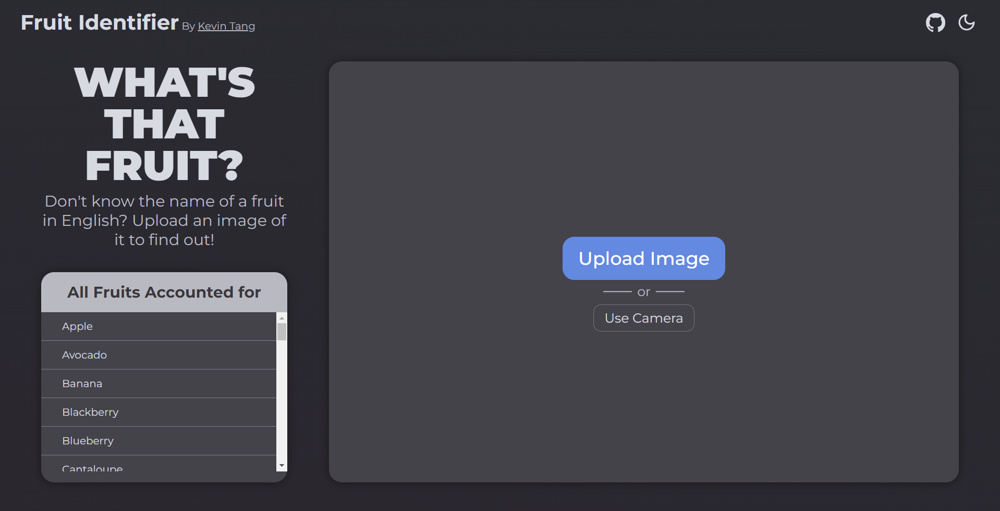

# [**Fruit Identifier**](https://kevster7000.github.io/Fruit-Identifier/)

***A machine learning program trained to identify the name of 45 different fruits from an image or camera.***

This project was made for Assignment 7 in CSCE 436, Human Computer Interaction. I had the impulsive idea to go the extra mile and make this thing for what was supposedly a simple assignment. Anywho, this was made with HTML, SASS, JavaScript, and a bit of SVGs. But the main character of this bad boy was made with [Teachable Machine](https://teachablemachine.withgoogle.com/), an easy way to create machine learning models. Though, I created this project fairly quickly (about 4 days), so it is not fully "finished" so to say. It is completely functional, but there are most likely some details and whatnot that disturb my perfectionist self enough to say it is not entirely finished. And, I don't plan on tidying the thing up or doing the nitpicky things at anytime whatsover; I'm not very attracted to that idea, and the project has gotten less appealing quite quickly. Regardless, this was a fun little side quest I embarked on whilst being slaughtered in the midst of the semester.
